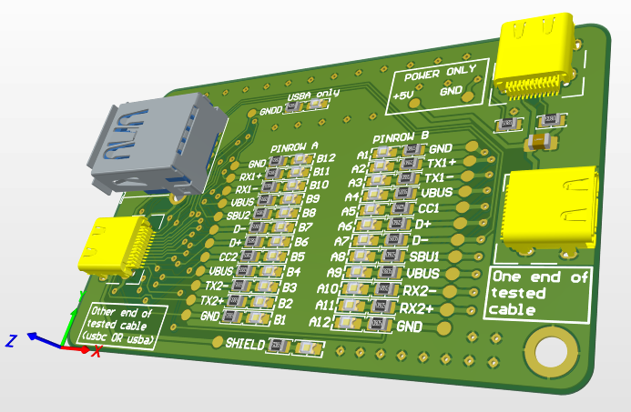
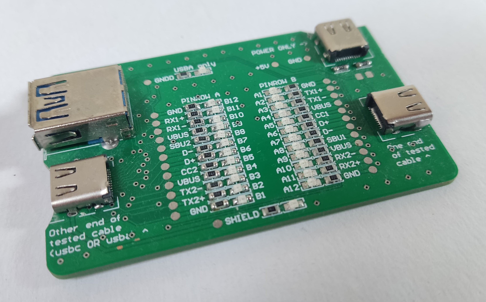
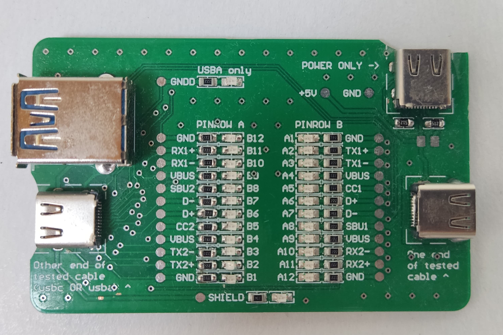
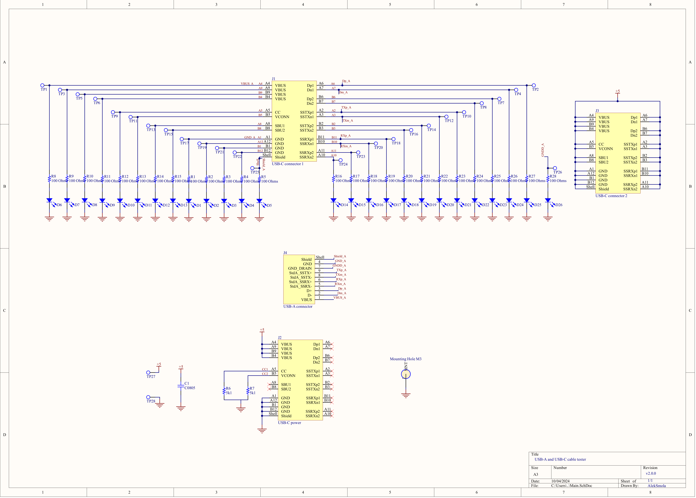
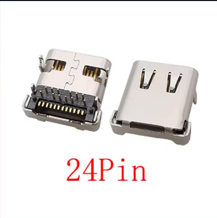
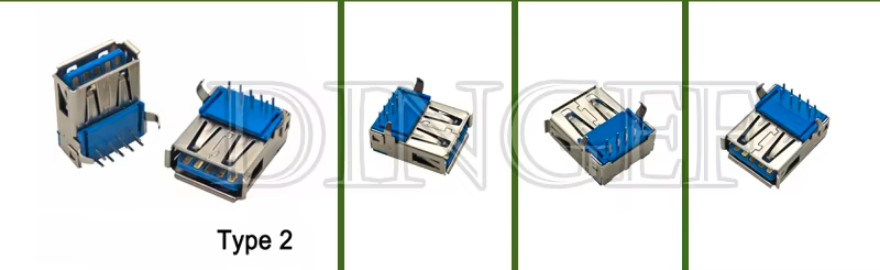

# __USB-A and USB-C cable tester__

Have you ever took a cable just to find out it does not transfer files or charge super slowly?

I got a solution for that!

Meet a cable tester which will clearly show you what cable can really handle! In a world were we have some weirdness of dozens of cables with the same USB-C connector which can do so many things, it's hard to know for sure which cable can be a monitor cable and which will only power a desk lamp. 

*Figure. Rendered v2.0.0 version.*

 

Have you ever wondered what’s the difference between `USB 3.0` and `USB 3.1 Gen 2` or `USB 3.1 Gen 1` and `USB 3.2 Gen 2`? Well this device won’t help you, but will tell for sure if a given cable can reach speed defined by above standards.

*Figure. Note that this is v1.0.0 with few bugs which were fixed in v2.0.0. Above images are of a v1.0.0. Can you spot all the bugs and applied modifications? These modification are not required when ordering v2.0.0*

## Features
- Shows if there is continuity between different USB pins, i.e. which standards cable supports;
- Can measure USB-C to USB-C cables
- Can measure USB-A to USB-C cables
- Powered from another USB-C (smart chargers compatible) or by soldering leads;
- neat solution in pocket size;

## Principle of operation 

If given cable has physical conductor inside, it will close the circuit and the corresponding LED will light up.

*Figure. Note that this is v1.0.0 with few bugs which were fixed in v2.0.0. Above images are of a v1.0.0. Can you spot all the bugs and applied modifications? These modification are not required when ordering v2.0.0*

 

## Documentation
Everything what's in here: [https://github.com/petl/USB-C-cable-tester-C2C-caberQU/blob/main/documentation/v3/caberQU_manual_v3.2_compressed.pdf](https://github.com/petl/USB-C-cable-tester-C2C-caberQU/blob/main/documentation/v3/caberQU_manual_v3.2_compressed.pdf) with the difference of lack of built-in battery supply and addition of USB-A connector.

My version of schematic:

Explanation of LEDs status: (Source as above)

| **Mode**                      | **Option A**                                             | **Option B**                                             |
|-------------------------------|----------------------------------------------------------|----------------------------------------------------------|
| **USB Power Delivery**        | VBUS & GND & CC1 & Shield                               | VBUS & GND & CC2 & Shield                               |
| **USB 2.0/1.1**               | VBUS & GND & D+ & D- & Shield                           | -                                                        |
| **USB 3.0/3.1/3.2/4**         |                                                          |                                                          |
| Single lane (3.0/3.1)         | VBUS & GND & TX1+ & RX1+ & TX1- & RX1- & Shield         | VBUS & GND & TX2+ & RX2+ & TX2- & RX2- & Shield         |
| Dual lane (3.2/4)             | VBUS & GND & TX1+ & RX1+ & TX1- & RX1- & TX2+ & RX2+ & TX2- & RX2- & Shield | -                                                        |
| **Debug Accessory Mode**      | VBUS & GND & D+ & D- & CC1 & SBU1 & TX1+ & RX1+ & TX1- & RX1- & Shield | VBUS & GND & D+ & D- & CC2 & SBU2 & TX2+ & RX2+ & TX2- & RX2- & Shield |
| **Alternate Mode**            | VBUS & GND & TX1+ & RX1+ & TX1- & RX1- & Shield         | VBUS & GND & TX2+ & RX2+ & TX2- & RX2- & Shield         |
| **Audio Adapter Accessory Mode** | GND & CC1 & CC2 & SBU1 & SBU2 & D+ & D- & Shield       (*VBUS is optional for concurrent charging of a device*) | -                                                        |

Source: [https://github.com/petl/USB-C-cable-tester-C2C-caberQU](https://github.com/petl/USB-C-cable-tester-C2C-caberQU)

## Manufacturing and Assembly

Defaults worked great for me. You may consider board thinner than 1.6mm since the USB-C connector through-hole will not reach such thickness. 

I have assembled the board myself since it is only few components and I only need 1 or 2 boards. Pinrow A is soldered by hand and Pinrow B with the use of solder paste and a heatplate. You can really see the difference in soldering quality! Ok to be fair with myself I was testing different values of resistors on Pinrow A so it does not look that great. 

## Parts
- 26x Any colour 0805 SMD LEDs, like these: [I bought orange](https://a.aliexpress.com/_EzzCGlx)

- 26x Desired 0805 SMD resistors. I picked 2.2k Ohms. Most of the available solutions has these LEDs set up really bright, which make looking at board unpleasant. You may go with even higher value resistors. Like these: [remember that it is pack od 20pcs so buy two such packs!](https://a.aliexpress.com/_EQssAUh)

- 2x Resistors 0805 5.1k Ohms for USB-C power connector, like these above [OPTIONAL if you don't USB-C for power]

- 3x USB-C connectors which can be soldered by hand with soldering iron (half pins are through-hole, other half requires removal of back cover of a connector or a use of soldering paste), like these: [R 24pin](https://www.aliexpress.com/item/1005007419369264.htm    ) (can be bought from more reputable sources like Mauser but then they cost more than the entire board assembled)[]. One connector is OPTIONAL if you power the board by soldering leads (from battery or whatnot)

- 1x USB-A in 3.0 standard, like these: [Type 2](https://a.aliexpress.com/_EHDPXqv) [OPTIONAL if you don't need USB-A functionality]

- 1x 0805 capacitor on 5V rail, just for stability [OPTIONAL or completely not required]

## Versions

### Changes in V2.0.0

- Corrected USB-C placement with respect to the board edge (wrong 3D model of a connector) - most cables in v1.0.0 should fit but some may not;
- Corrected some text overlay being holed by vias ( via is text);
- Corrected Pinrow B - neater;
- Corrected via placement;
- Added keyring holder of diameter 3mm;

NOTE: v2.0.0 was not tested by me (not manufactured) yet. It should work, but there may be some bugs.

### V1.0.0

Initial release, tested and working. Few life improvement things should be implemented. Mainly: USB-C connectors placed too far from board edge. This is because of wrong 3D model in ECAD software :/. It works but some cables may have problems reaching. Somehow (Only Gods know how...) there are vias on the text. No idea how it happened since I checked it. Pins from USB-C are a bit short for 1.6mm board, they can still be soldered and they work just fine, but they do not protrude to the other side. Few other things can be observed, but device is fully functional.

It was not tested with higher speed cables, since as it appeared, I don't own any.

## Sources and References

1. [https://www.usb.org/sites/default/files/USB%20Type-C%20Spec%20R2.0%20-%20August%202019_0.pdf](https://www.usb.org/sites/default/files/USB%20Type-C%20Spec%20R2.0%20-%20August%202019_0.pdf)

2. [https://github.com/petl/USB-C-cable-tester-C2C-caberQU](https://github.com/petl/USB-C-cable-tester-C2C-caberQU)

3. [https://caberqu.com](https://caberqu.com)

4. [https://electronics.stackexchange.com/questions/442063/usb-c-ufp-cc-configuration-what-rd-resistor-value-i-need-to-use-to-be-able-to-d](https://electronics.stackexchange.com/questions/442063/usb-c-ufp-cc-configuration-what-rd-resistor-value-i-need-to-use-to-be-able-to-d)